# Nature Walkeer

**Nature Walkeer** is an Android application designed to encourage users to stay active by walking. The app tracks daily steps, converts them into coins, and allows users to use these coins to purchase in-app upgrades and plants. Users can activate boosts, care for plants, and participate in challenges. The app also includes features for user authentication and profile management.


## Features

### 1. Step Tracking
- **Real-Time Step Tracking**: The app tracks the user's steps throughout the day using Android's built-in step sensor. It updates the step count regularly when the app is in the foreground or background, ensuring that users receive coins for each step taken.
- **Daily and Weekly Step Goals**: Users can set daily step goals, and the app keeps track of weekly step counts, helping users to stay motivated and active.

### 2. In-App Currency
- **Coins for Steps**: Every step taken by the user earns them coins. These coins can be used to purchase virtual plants and upgrades within the app.
- **Boosts**: Users can activate boosts that multiply the number of coins earned per step for a limited time.

### 3. Virtual Plant Care
- **Plant Store**: Users can buy plants from a store using the coins they’ve earned.
- **Plant Care**: Users can plant their plants and grow them until they are ready to be harvested for additional rewards.

### 4. Firebase Integration
- **Firestore Database**: The app uses Firestore to store user data, including step counts, coins, and plant information. This allows for real-time data syncing across devices.
- **Firebase Authentication**: The app includes Firebase Authentication to manage user sign-up, login, and profile management securely. Users can sign in using email and password.
- **Firebase Storage**: The app utilizes Firebase Storage for handling most of the content, such as pictures or icons. These images are stored securely, and their URLs are saved in Firestore.

### 5. User Management
- **Profile Management**: Users can view and edit their profile information, including changing their password and profile picture.
- **Leaderboard**: The app includes a leaderboard feature that ranks users based on their current amount of coins.


## Screenshots

<p align="center">Dashboard</p>
<p align="center">
   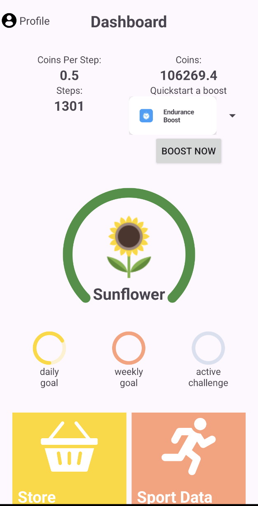 
   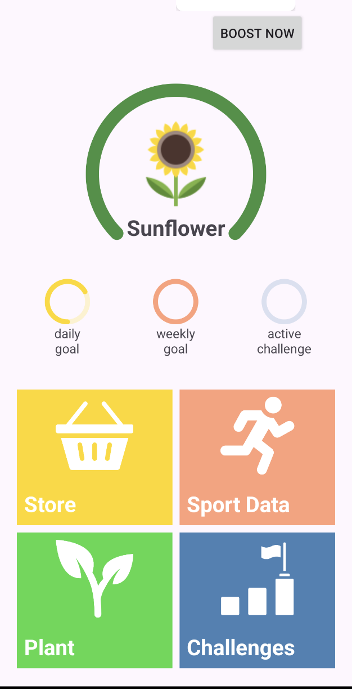 
</p>

<p align="center">Sport Data</p>
<p align="center">
   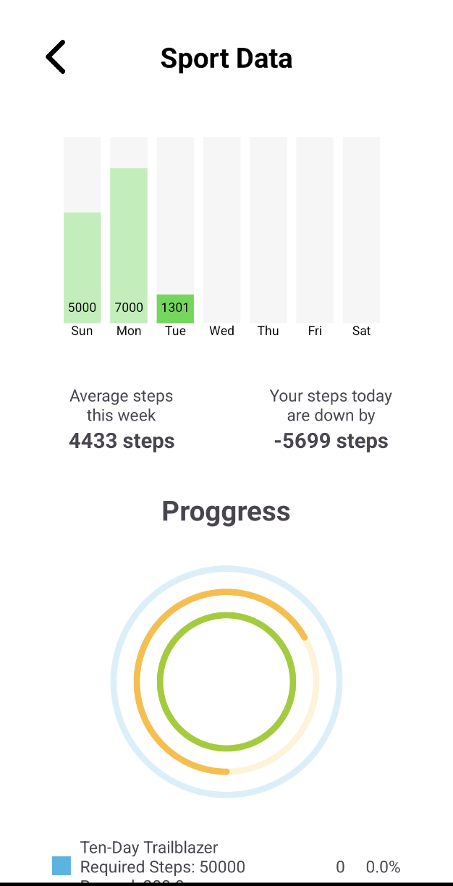 
   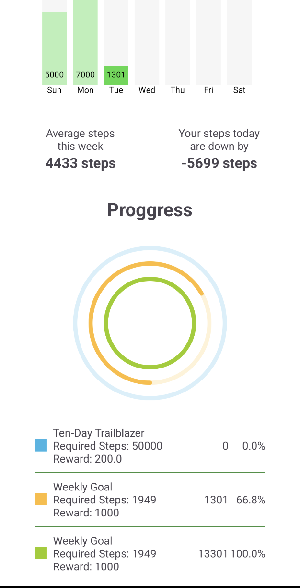 
</p>

<p align="center">Store</p>
<p align="center">
   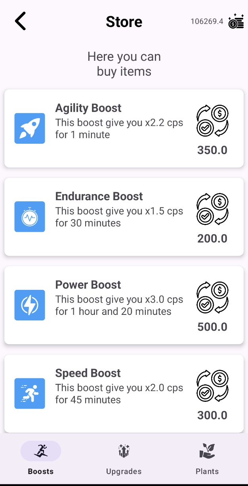 
   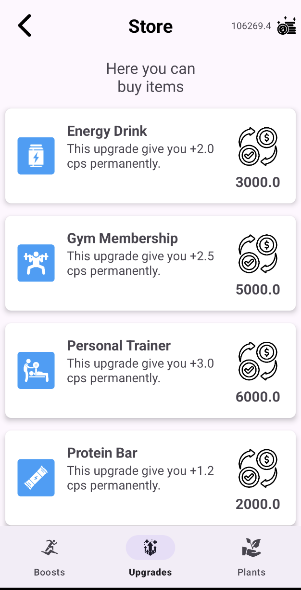 
   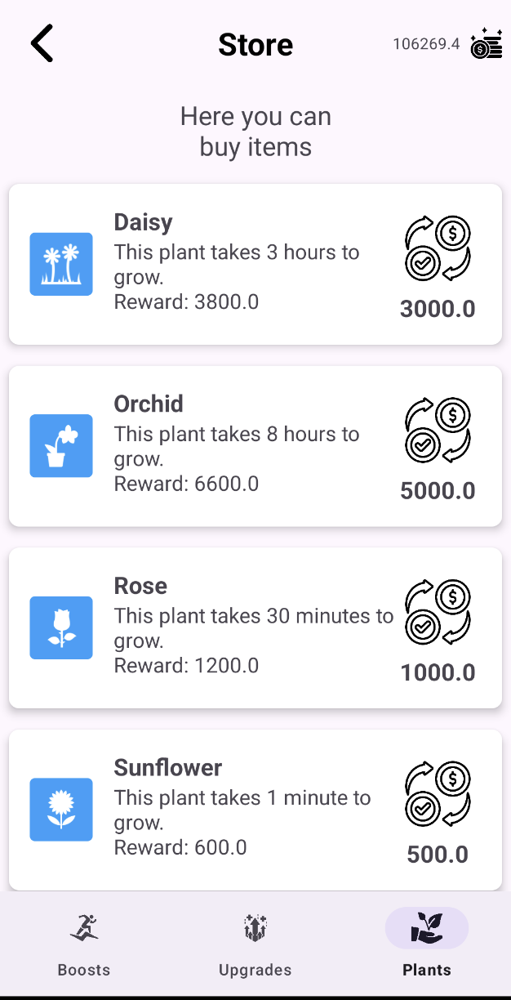 
</p>

<p align="center">Plant Care</p>
<p align="center">
   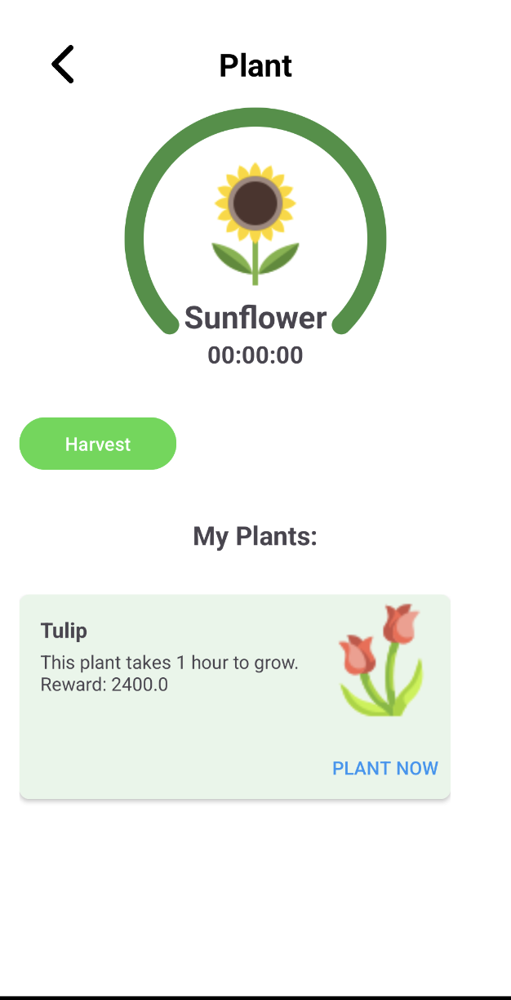 
   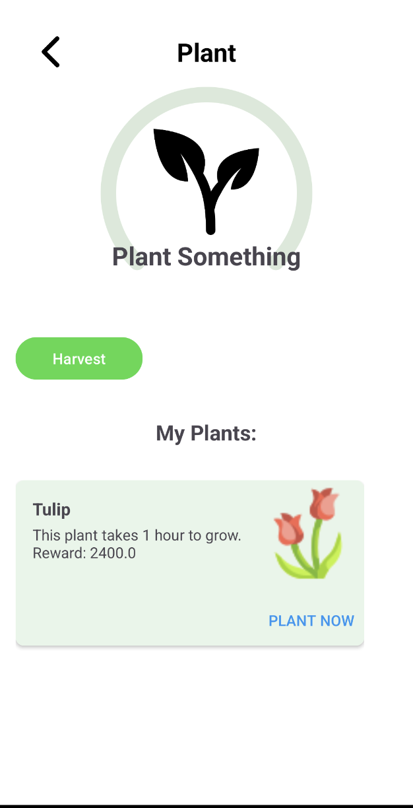 
</p>

<p align="center">Challenge Yourself</p>
<p align="center">
   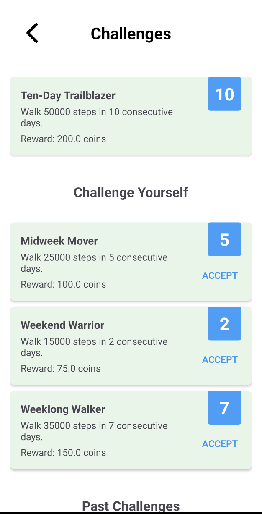 
</p>

<p align="center">Compete Againts Others</p>
<p align="center">
   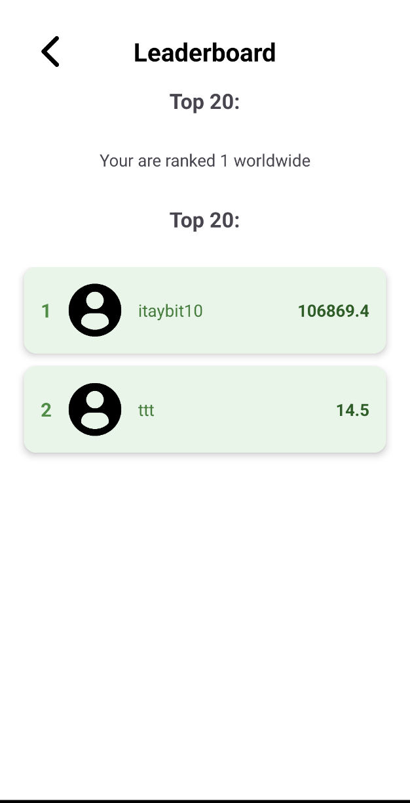 
</p>

## Demo Video

<p align="center">
  <a href="https://youtu.be/bsFHrgH8_00">
    
  </a>
</p>


## Installation

**To install this repository:**
1. **Clone the repository**:
   ```bash
   git clone https://github.com/Itay-Biton/Nature-Walkeer.git
   ```
2. **Open in Android Studio**:
   - Open Android Studio and select "Open an existing project."
   - Navigate to the cloned repository and open it.

3. **Set up Firebase**:
   - Add your Firebase project configuration files (e.g., `google-services.json`) to the `app` directory.
   - Ensure Firebase Authentication and Firestore are set up in your Firebase Console.

4. **Run the App**:
   - Build and run the project on an Android device or emulator.

  
## Download and Install Nature Walker

1. **Download the App:**
   - Click [here](https://github.com/Itay-Biton/Nature-Walker/blob/main/Nature-Walker-Installation.apk) to download the latest version of the `Nature-Walker-Installation.apk`.

2. **Bypass Google Virus Scan:**
   - If prompted by Google, you can safely bypass the virus scan warning. The APK is secure and has been tested thoroughly.

3. **Install the App:**
   - Once downloaded, open the APK file and follow the on-screen instructions to install Nature Walker on your Android device.

## Getting Started

After installing the app, you can sign up with your email or use Google Authentication to log in. Start walking, earn coins, and enjoy the interactive features Nature Walker offers.


## Contact

If you have any questions or feedback, don't hesitate to get in touch via [email](mailto:itaybit10@gmail.com).


## License and Copyright

© 2024 Itay Biton. All rights reserved.

This project is owned by Itay Biton. Any unauthorized reproduction, modification, distribution, or use of this project, in whole or in part, is strictly prohibited without explicit permission from the author.

For academic purposes or personal review, please ensure proper credit is given to Itay Biton, and include a link to the original repository.

This project is intended for portfolio demonstration purposes only and must not be duplicated or repurposed without permission. If you're interested in collaborating or using parts of this project for educational reasons, please contact me directly.


## Note to Recruiters

Please note that this project is part of my professional portfolio and should not be copied or reused. If you’re interested in my work or would like to discuss potential job opportunities, feel free to reach out via the provided email. I am open to exploring new projects and opportunities.

